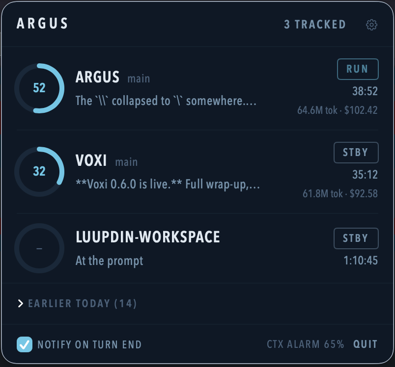
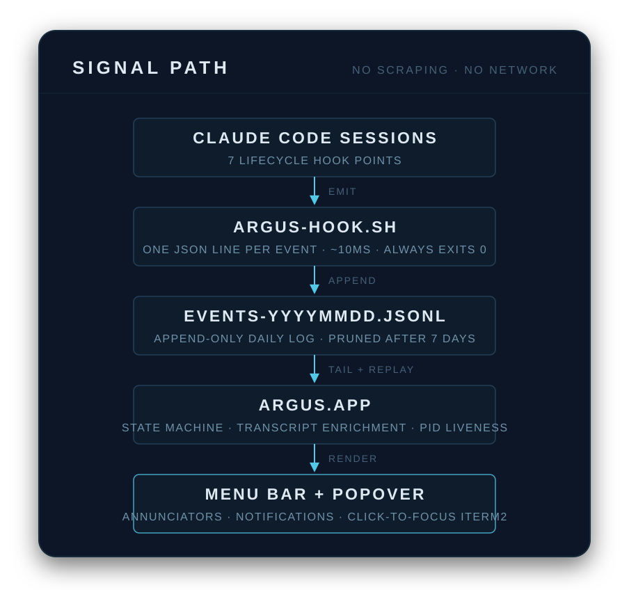

<div align="center">

# 👁 Argus

**The hundred-eyed watchman for your Claude Code sessions.**

A native macOS menu bar app that shows every running session at a glance:
who's working, who's blocked on you, who finished.

[](#install)
[](Package.swift)
[](Package.swift)
[](LICENSE)

</div>

---

In Greek myth, Argus Panoptes was the giant with a hundred eyes. Only a few ever closed to sleep, which is why Hera made him her watchman: nothing got past him.

That's the job here. You're running four Claude Code sessions across four repos, and the moment one stops to ask permission, you're the bottleneck. Nobody tells you. The session just sits there, holding, while you're heads-down somewhere else.

Argus tells you.

<table>
<tr>
<td width="50%"></td>
<td width="50%"></td>
</tr>
</table>

## A glass cockpit for your sessions

The popover reads like an instrument panel, not a dashboard of charts. One row per session. Each leads with a context-window ring gauge (read it like an N1 gauge: amber at 65%, with a macOS notification on crossing and re-arm below 60% after compaction) and carries an avionics-style annunciator:

| | Annunciator | Meaning |
|---|---|---|
| 🟠 | **HOLD** | Blocked mid-turn: permission prompt, elicitation, or the agent needs your input |
| 🔵 | **REVIEW** | Turn finished after real work (used tools). Something to look at |
| 🟢 | **RUN** | Prompt submitted or tools firing. Pulses while it works |
| 🟡 | **STALL** | Working but silent: 5 min without events (30 min inside a tool call, since long builds fire no hooks; transcript writes count as activity) |
| ⚪ | **STBY** | At the prompt, nothing pending |
| 🔴 | **LOST** | Process gone without a clean exit (history) |
| ⚪ | **END** | Clean exit (history) |

Avionics colour law applies throughout: amber only ever means *act now*. HOLD flashes, RUN breathes, and those are the only two animations in the app. Everything else holds steady so movement always means something.

The menu bar icon is the summary instrument: an exclamation eye with the blocked count, a badged eye with the ready count when nothing is blocked, a plain eye when all is quiet. When a session flips to needs-you, a notification fires (60s per-session debounce), and clicking it jumps you to the exact terminal tab and pane.

## How it works

The signal path above is the whole architecture: hooks in, log file, one app tailing it.

- **The hook** is ~50 lines of dependency-free bash that appends one JSON line per Claude Code lifecycle event: `SessionStart`, `UserPromptSubmit`, `PreToolUse`, `PostToolUse`, `Notification`, `Stop`, `SessionEnd`. It also captures `ITERM_SESSION_ID` and `TERM_PROGRAM` (click-to-focus, per-session terminal detection) and `$PPID` (liveness, Ghostty focus). It runs synchronously inside your sessions, so it is built to be unnoticeable: no forks, ~10ms, always exits 0.
- **The app** never scrapes terminals. All state comes from the event log, transcript files, and liveness checks. A process is identified by `(pid, kernel start time)`, never by name, because the Claude CLI sets its process title to a bare version string.
- **Privacy is structural**: zero external dependencies, no network calls, no telemetry, and transcript content never leaves your screen. An app that watches your coding sessions should have nothing to hide.

## Install

Requirements: macOS 14+, a Swift toolchain (Xcode or Command Line Tools), `python3` (used once by the hook installer to merge JSON), and [iTerm2](https://iterm2.com) and/or [Ghostty](https://ghostty.org) 1.3+ (whose AppleScript support is a preview feature — leave `macos-applescript` enabled). Each session's terminal is auto-detected; there is no Terminal.app fallback.

```sh
./scripts/bundle.sh            # builds dist/Argus.app (ad-hoc signed)
open dist/Argus.app
```

First launch opens a setup window: pick your editor and terminal, install the capture hooks from there (or run `./scripts/install-hooks.sh` by hand — backup kept, idempotent), and approve the notification prompt. On first row-click, approve the per-terminal Automation prompt (iTerm2 and Ghostty each prompt once). Running Claude sessions pick up the hooks on their next session start. Re-run setup any time from the popover footer's SETUP button.

For autostart: `cp -R dist/Argus.app /Applications/` and add it as a Login Item in System Settings.

To remove: `./scripts/uninstall-hooks.sh` and quit the app.

## Working the panel

Click a row to jump to that session's terminal tab. Right-click for the rest: open in editor, open on GitHub (derived from `git remote`), open in Linear (ticket id parsed from the branch name, e.g. `feat/ENG-123`, else a configured board URL), copy session id or resume command, mark reviewed, snooze notifications 1h, end session (SIGTERM, confirmed). Hovering a row reveals editor/GitHub/snooze shortcuts.

Rows show project name, git branch, a working-tree chip (`●dirty ↑ahead ↓behind`), time in state, the last assistant message, and model + token count with estimated cost. History rows from earlier today can be resumed with a click (`claude --resume` in a fresh tab; iTerm2 rows that still have their tab open focus it instead — Ghostty has no per-session identity once claude exits, so its history rows always resume).

Config lives at `~/.config/argus/config.json` (created by setup, or on first gear-click):

| Key | Does |
|---|---|
| `editor` | App name for `open -a` (default Zed) |
| `terminal` | `iTerm2` or `Ghostty` — only for sessions whose terminal can't be detected (default iTerm2) |
| `linearWorkspace` | Your linear.app/&lt;slug&gt; |
| `contextAlarm` | Alarm threshold in percent (default 65, clamped 10–95) |
| `projects.<cwd>.{board,github}` | Per-project link overrides |

Any repo can override these locally with a `.argus.json` (top-level `editor`/`linearWorkspace`/`board`/`github`).

## Dev

```sh
swift build && swift test    # the whole gate, runs in about a second
swift run                    # full UI; notifications fall back to NSLog (no bundle)
```

Zero external dependencies is deliberate, and it keeps the loop honest: the entire app builds in ~1s. Steering docs for AI-assisted development live in [CLAUDE.md](CLAUDE.md) and [steering/](steering); architecture and the decision log are in [docs/architecture.md](docs/architecture.md).

## Limitations (v1)

- Sessions spanning midnight re-materialise on their first event after rollover.
- Cost is an estimate ("~$") from per-turn transcript usage and a hardcoded price map; treat `/cost` as authoritative.
- Claude Code only. Adapters for other agent CLIs would slot in at the event-log layer.
- iTerm2 and Ghostty 1.3+ only for focus/resume (see Install); Ghostty history rows can't detect a still-open tab.

## License

MIT, see [LICENSE](LICENSE). Named for the watchman, built for the people running him ragged.
